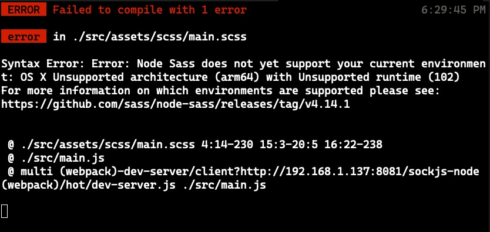

# eva

Eva task that consists of 2 parts, JWT Vuex - Highcharts Components

## Table of Contents

- [Installation](#installation)
- [Usage](#usage)

## Installation

The empty version of the project is giving errors related to my system OS and architecture, I am using an M1 Mac, so i had to update some styling dependencies.



M1 Related Error

## Usage
To start the project run (you might need to use -f tag for install):

```sh

npm i (-f)
npm run serve
```

- Check localStorage to see token and userInfo
- Highchart components are in the HighCharts page that can be navigated using menu
- To establish communication between two sibling components i decided to use event based communication.

Feel free to reach for any problems and suggestions.
